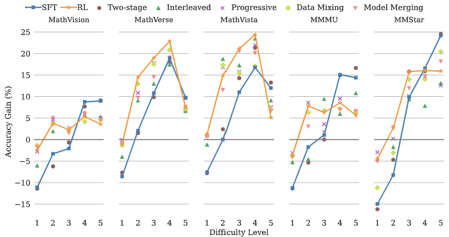

# The Synergy Dilemma of Long-CoT SFT and RL: Investigating Post-Training Techniques for Reasoning VLMs

<p align="center">
<a href="https://www.arxiv.org/pdf/2507.07562" alt="arXiv">
    </a>
</p>




Large vision-language models (VLMs) increasingly adopt post-training techniques such as long chain-of-thought (CoT) supervised fine-tuning (SFT) and reinforcement learning (RL) to elicit sophisticated reasoning. While these methods exhibit synergy in language-only models, their joint effectiveness in VLMs remains uncertain. We present a systematic investigation into the distinct roles and interplay of long-CoT SFT and RL across multiple multimodal reasoning benchmarks. We find that

- 📌 Long-CoT SFT improves performance on difficult questions by in-depth, structured reasoning, but introduces verbosity and degrades performance on simpler ones. 
Long-CoT SFT enhances complex reasoning but becomes verbose and underperforms on simple questions
- 📌 In contrast, RL promotes generalization and brevity, yielding consistent improvements across all difficulty levels, though the improvements on the hardest questions are less prominent compared to SFT. 
- 📌 Surprisingly, combining them through two-staged, interleaved, or progressive training strategies, as well as data mixing and model merging, all fails to produce additive benefits, instead leading to trade-offs in accuracy, reasoning style, and response length. 
- 📌 This "synergy dilemma" highlights the need for more seamless and adaptive approaches to unlock the full potential of combined post-training techniques for reasoning VLMs.


## Benchmarks with difficulty level tags

| **MathVision** | **MathVerse** | **MathVista** | **MMMUval** | **MMStar** |
|----------------|---------------|---------------|-------------|------------|
| 🤗[link](https://huggingface.co/datasets/JierunChen/MathVision_with_difficulty_level)    | 🤗[link](https://huggingface.co/datasets/JierunChen/MathVerse_with_difficulty_level)    | 🤗[link](https://huggingface.co/datasets/JierunChen/MathVista_with_difficulty_level)    | 🤗[link](https://huggingface.co/datasets/JierunChen/MMMU_with_difficulty_level)    | 🤗[link](https://huggingface.co/datasets/JierunChen/MMStar_with_difficulty_level)    |

## Our training dataset Eureka-Distill

The 34k training dataset and 0.7k val dataset can be downloaded [here](https://huggingface.co/datasets/JierunChen/Eureka-Distill).

## Fine-tuned Models

| **Model** | **MathVision** | **MathVerse** | **MathVista** | **MMMUval** | **MMStar** | **Avg.** | HF Link |
|-----------|----------------|---------------|---------------|-------------|------------|----------|----------|
| Qwen2.5-VL-7B | 26.1 | 42.3 | 66.4 | 53.5 | 63.2 | 50.3 | 🤗[link](https://huggingface.co/Qwen/Qwen2.5-VL-7B-Instruct)
| + SFT | 29.7 | 47.2 | 65.6 | 53.6 | 60.8 | 51.4 | 🤗[link](https://huggingface.co/JierunChen/SFT-RL-SynergyDilemma-SFT_Eureka_Distill)
| + RL | 29.0 | 52.1 | 72.6 | 55.1 | 66.5 | 55.1 | 🤗[link](https://huggingface.co/JierunChen/SFT-RL-SynergyDilemma-RL)
| + Two-stage SFT & RL | 29.3 | 47.1 | 66.6 | 53.0 | 60.9 | 51.4 | 🤗[link](https://huggingface.co/JierunChen/SFT-RL-SynergyDilemma-Two_stage)
| + Interleaved SFT & RL | 29.2 | 48.7 | 71.8 | 54.1 | 64.3 | 53.6 | 🤗[link](https://huggingface.co/JierunChen/SFT-RL-SynergyDilemma-Interleave)
| + Progressive SFT & RL | 29.8 | 51.0 | 72.4 | 55.5 | 65.9 | 54.9 | 🤗[link](https://huggingface.co/JierunChen/SFT-RL-SynergyDilemma-Progressive)
| + Data Mixing | 29.2 | 51.2 | 72.0 | 55.1 | 62.7 | 54.0 | 🤗[link](https://huggingface.co/JierunChen/SFT-RL-SynergyDilemma-Data_Mixing)
| + Model Merging | 29.6 | 50.4 | 71.8 | 53.7 | 66.2 | 54.3 | 🤗[link](https://huggingface.co/JierunChen/SFT-RL-SynergyDilemma-Model_Merging)

## Training
Code will be released soon. Please stay tuned :)

## Acknowledgement
We train models using the [verl](https://github.com/volcengine/verl) and the [LLaMA-Factory](https://github.com/hiyouga/LLaMA-Factory) frameworks, and evaluate them using the [VLMEvalKit](https://www.google.com.hk/url?sa=t&rct=j&q=&esrc=s&source=web&cd=&ved=2ahUKEwje4ui7prSOAxWxdvUHHe3bN50QFnoECAoQAQ&url=https%3A%2F%2Fgithub.com%2Fopen-compass%2FVLMEvalKit&usg=AOvVaw0J3YwNySHLuWZHrhC_Gk9P&opi=89978449) framework.

## Citation

If you find this project useful in your research, please consider citing this BibTex:

```
@misc{chen2025synergydilemmalongcotsft,
      title={The Synergy Dilemma of Long-CoT SFT and RL: Investigating Post-Training Techniques for Reasoning VLMs}, 
      author={Jierun Chen and Tiezheng Yu and Haoli Bai and Lewei Yao and Jiannan Wu and Kaican Li and Fei Mi and Chaofan Tao and Lei Zhu and Manyi Zhang and Xiaohui Li and Lu Hou and Lifeng Shang and Qun Liu},
      year={2025},
      eprint={2507.07562},
      archivePrefix={arXiv},
      primaryClass={cs.CL},
      url={https://arxiv.org/abs/2507.07562}, 
}
```
